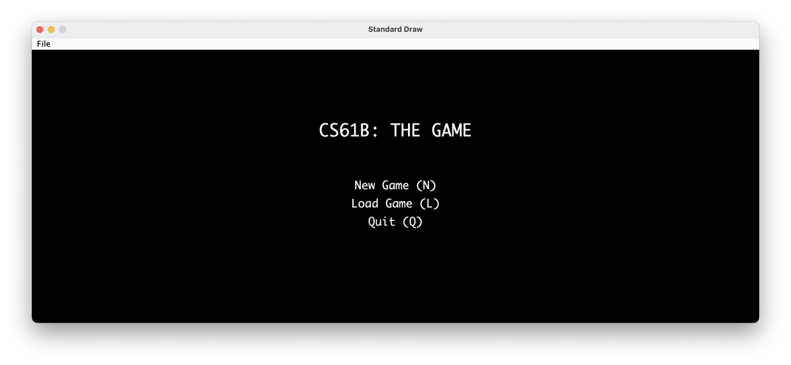

# UCB-cs61b

## Proj 0 

Simulating the motion of N objects in a plane, accounting for the gravitational forces mutually affecting each object as demonstrated by Sir Isaac Newton’s [Law of Universal Gravitation](http://en.wikipedia.org/wiki/Newton's_law_of_universal_gravitation).

## Proj1

- Build implementations of a "Double Ended Queue" using both lists and arrays.
- Learn how to write our own tests for those data structures, and will use the Double Ended Queue to solve some small real world probelms.

## Proj2

- Phase 1: World Generation
  - Generate rooms randomly
  - Generate hallways randomly like a maze
  - Looking for a connection for each room
  - Uncarving dead heads
  - Reference: [Rooms and Mazes: A Procedural Dungeon Generator](https://journal.stuffwithstuff.com/2014/12/21/rooms-and-mazes/)
- Phase 2: Interactivity

